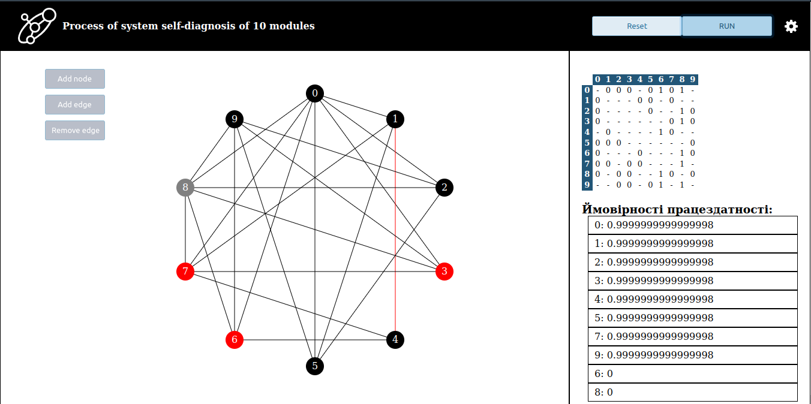
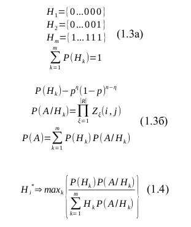
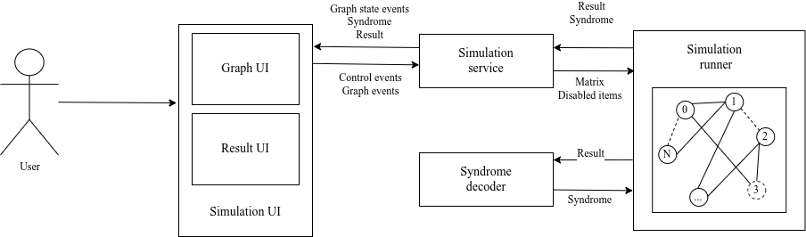

# Self-Diagnosis Algorithm
## Table of contents
1. [Algorithm overview](#algorithm_overview)
2. [Architecture](#architecture)
3. [How to run](#how_to_run)

<div id="algorithm_overview"></div>

## Algorithm overview
An Angular application that was designed to simulate self-diagnosis algorithm. 
This algorithm was developed by [Oleg Barabash (Барабаш Олег Володимирович)](https://uk.wikipedia.org/wiki/Барабаш_Олег_Володимирович) 
in research work "CONSTRUCTION OF FUNCTIONALLY SUSTAINABLE DISTRIBUTED INFORMATION SYSTEMS" 
(ПОСТРОЕНИЕ ФУНКЦИОНАЛЬНО УСТОЙЧИВЫХ РАСПРЕДЕЛЕННЫХ ИНФОРМАЦИОННЫХ СИСТЕМ. Киев – 2004., 227c.)



Simulation consists of next stages:
1. Building of testing system (randomly or using control menu).
2. Creating of failures in testing system - disabling of edges. This can be done manually at any point of time or
  randomly in testing mode.
3. Collecting of testing information.
4. Checking of sufficiency. If negative then continue to collect information.
5. Syndrome decryption  - calculate probabilities of nodes validity based on result matrix.

> __Note!__ This algorithm does not include situation when edges have failures.
> In this case we have to consider that invalid edge does not exist ('-' in result matrix instead of '1').

### Collecting of testing information
In any moment of time node can start testing any of its neighbours. 
The testing is considered as a task whose result is compared with a reference value.
Then testing module save result into internal matrix (0 - is valid, otherwise - 1).
If tested module considered as valid, then internal matrix is passed to it.
This allows valid modules to collect more testing result than invalid.

### Checking of sufficiency
Each module check its internal matrix (Rfi) whether collected information is enough to start decrypt syndrome.
Currently, this is experimental phase and is simple counter. Counter = N * K, where N - number of modules in system,
and K - predefined coefficient (by default 1.7, but can be changed in settings).

### Syndrome decryption
Calculating modules' validity probabilities using the algorithm that based on Bayes' theorem.



where:
* Hk - hypothesis;
* P(Hk) - the probability of the hypothesis fulfillment;
* P(A/Hk) - conditional probability of obtaining the result Rf;
* P(A) - full probability of obtaining the result Rf;
* Hi* - aposteriori probability of serviceability of a system node.

<div id="architecture"></div>

## Architecture


* __Simulation runner__ is abstraction on [emulation.service.ts](src/app/emulation/logic/emulation.service.ts)
* __Syndrome decoder__ is abstraction on [syndrome-analyzer.service.ts](src/app/emulation/logic/syndrome-analyzer.service.ts)

<div id="how_to_run"></div>

## How to run
1. Install [npm](https://docs.npmjs.com/downloading-and-installing-node-js-and-npm) (`v8.13.0` or higher) and [node](https://nodejs.org/en/download/) (`v17.9.0` or higher)
2. Install dependencies running:
  ```shell
npm i
```
3. Run application
  ```shell
npm run start
```
4. Open the application in browser [localhost:4200](http://localhost:4200)


## TODO
- [ ] Implement Web worker to decode syndrome
- [ ] Improve matrix generation
